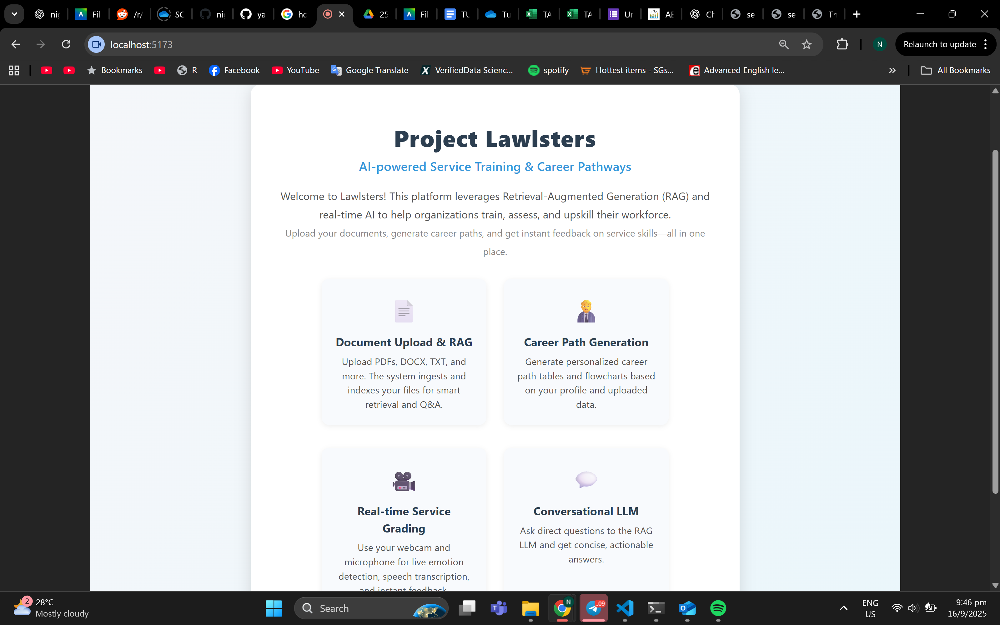
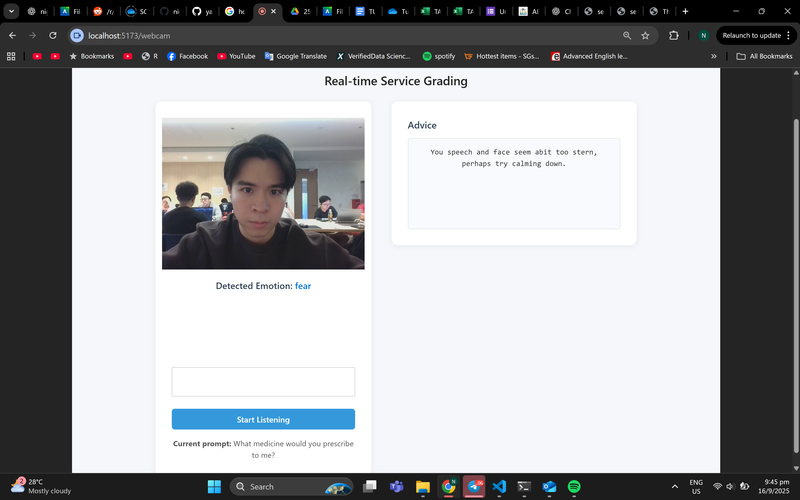
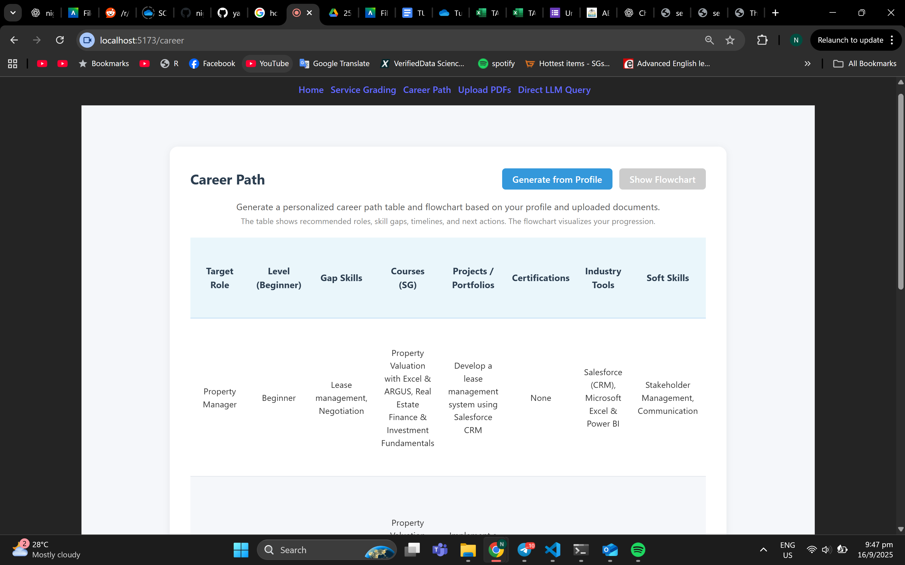
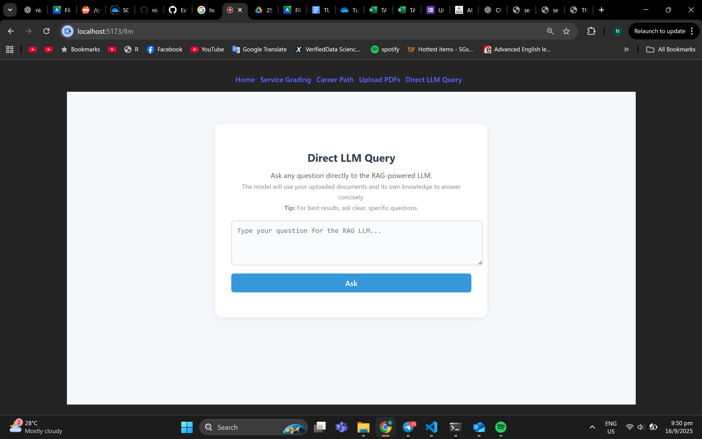
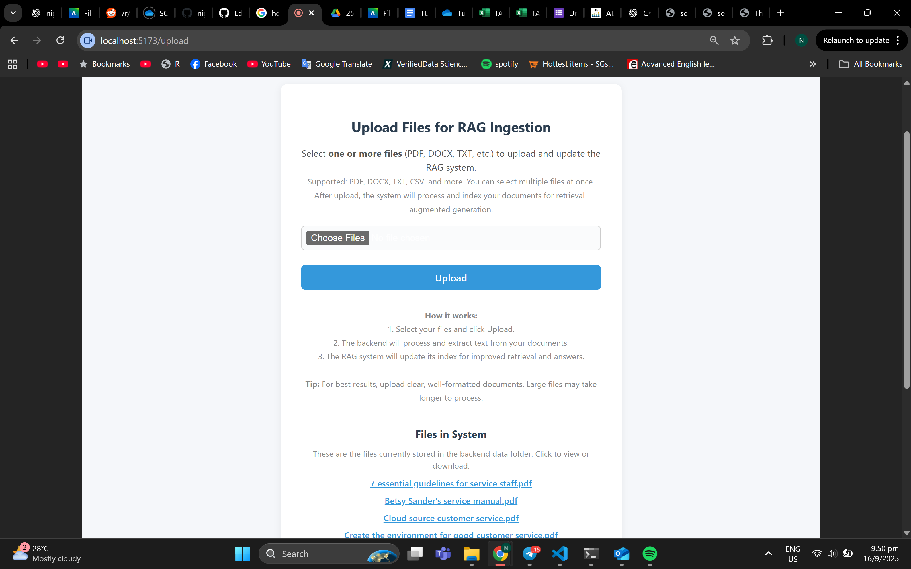

# SAP X NTU Team Lawlsters 

This is our repository for our submission for SAP x NTU's hackathon. You will need to set up dependencies before running the project.

## Getting Started


1. **Install dependencies:**
   ```bash
   npm install
   pip -r install 'requirements.txt'
   ```
   This will create a `node_modules` folder in the `figma_make` project.

2. **Fill in your openAI API key**
    ```bash
    cd backend/ragcore/generate.py
    ```
    Replace the OPENAI_API_KEY with your own openai api key, https://platform.openai.com/api-keys

3. **Run the development server:**
   ```bash
   npm run dev
   ```

   If you encounter an error related to `@vitejs/plugin-react-swc`, install it with:
   ```bash
   npm install --save-dev @vitejs/plugin-react-swc
   ```

4. **Navigate to backend directory and run the flask backend:**
    ```bash
    cd backend
    python rag_api.py

5. **Expected Output:**
    Go to: http://localhost:5173/ on your local browser.
   - On successful execution, you should see output similar to the screenshot below:
   1. Our landing page
    


   2. Our real-time service grading assistant
    


   3. Our automatic career path generator
    


   4. Our direct RAG-LLM query page
    


   5. Our page for file uploads
    

